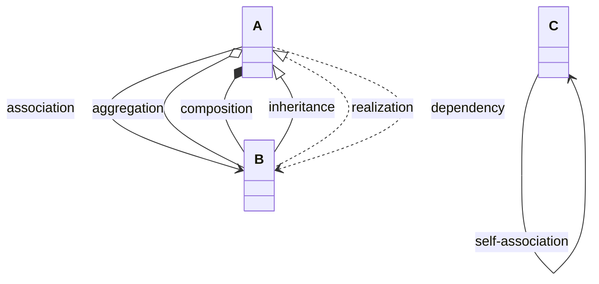
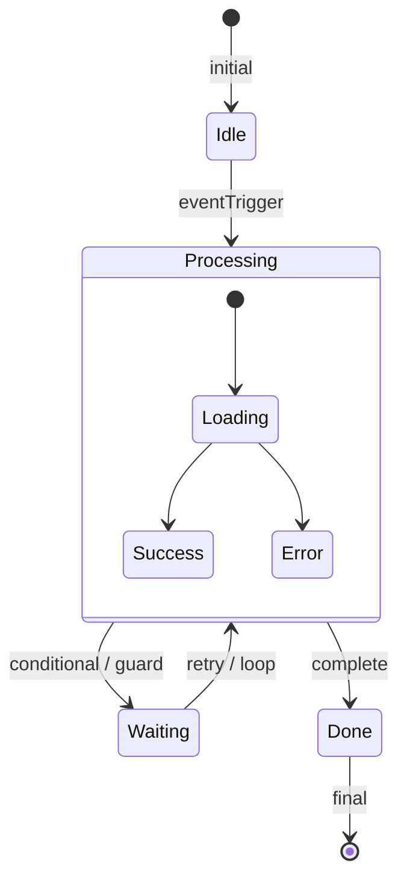
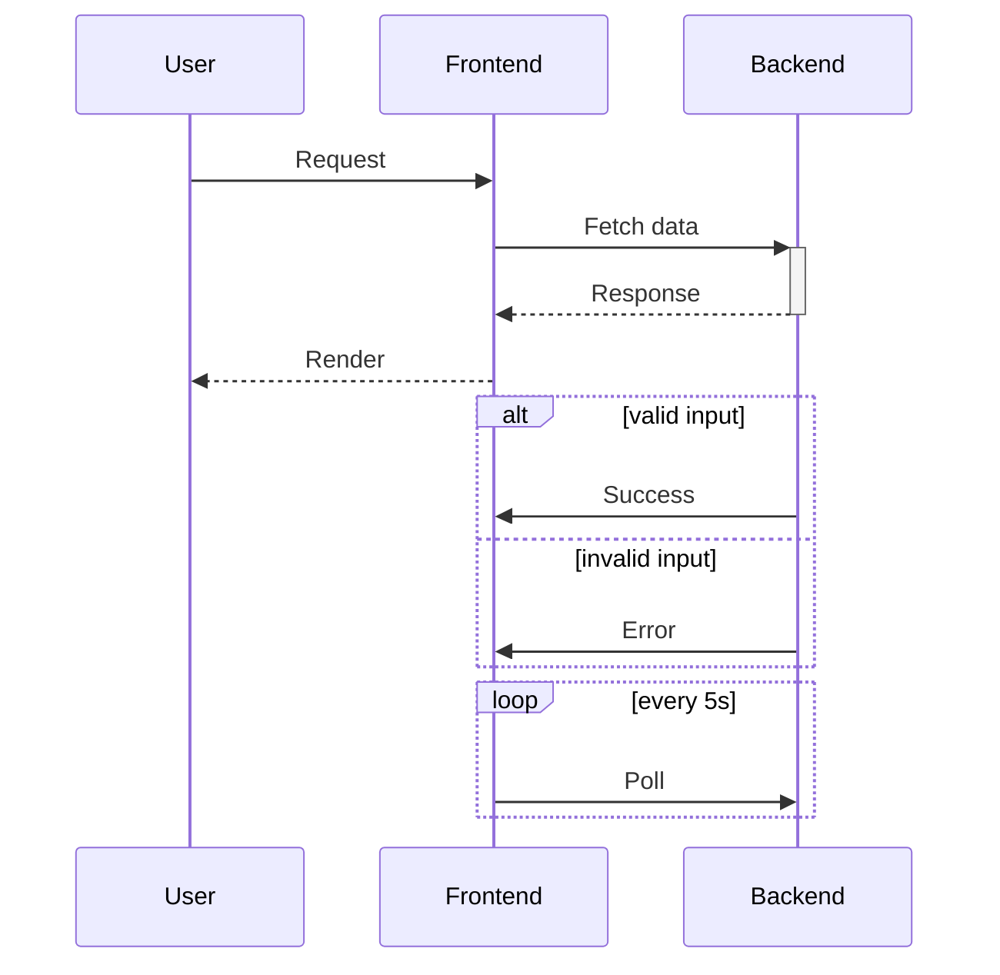
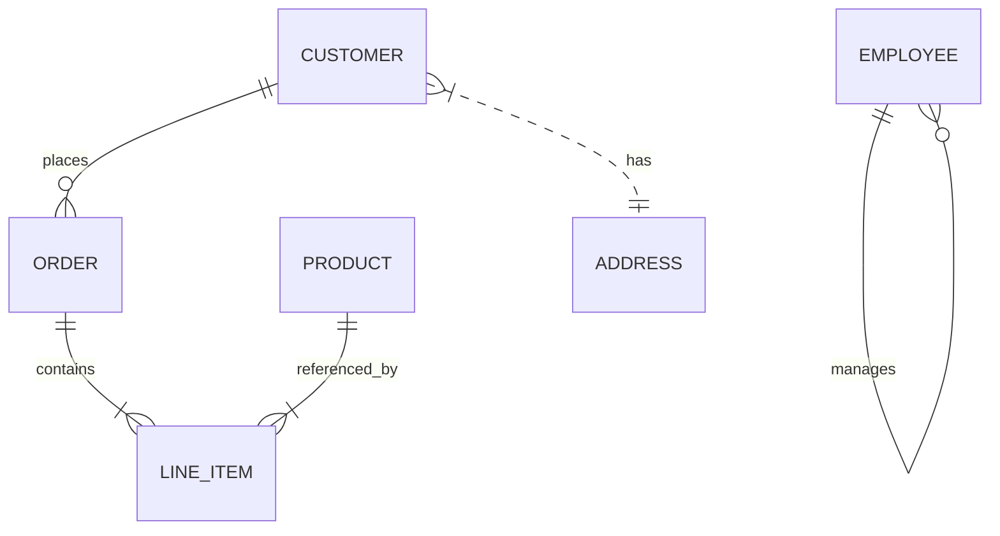
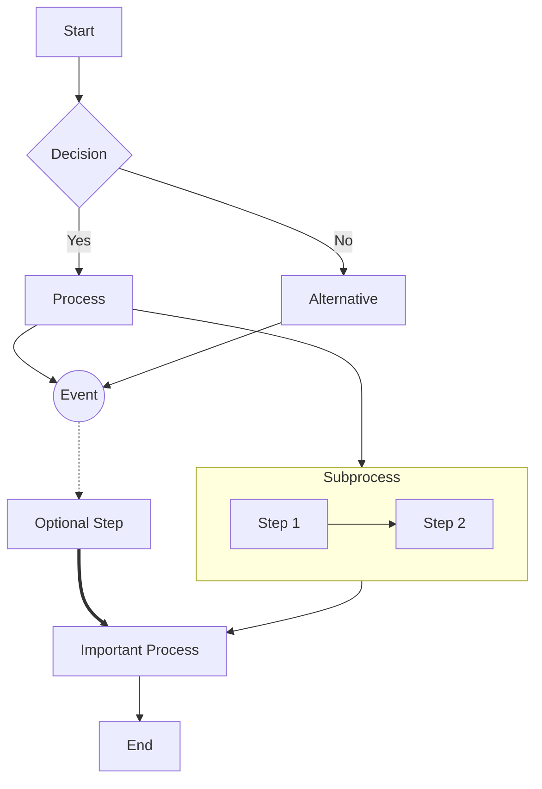
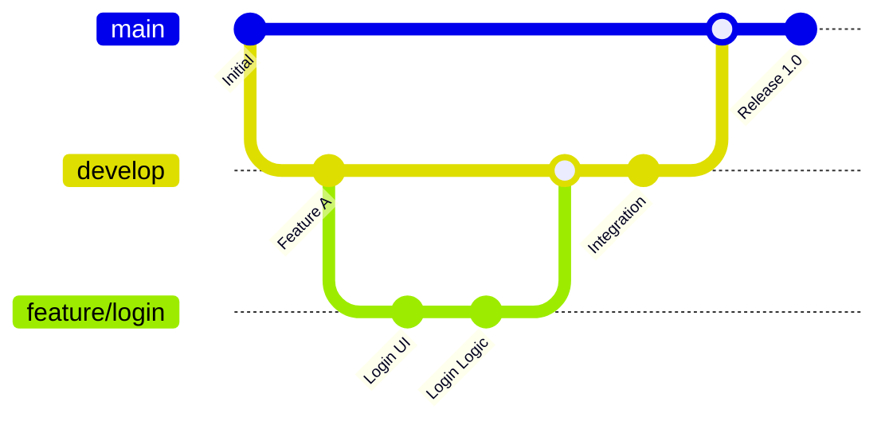
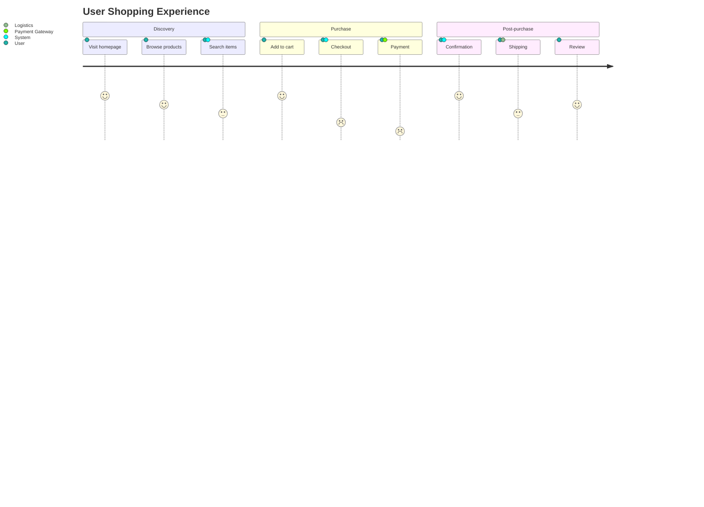
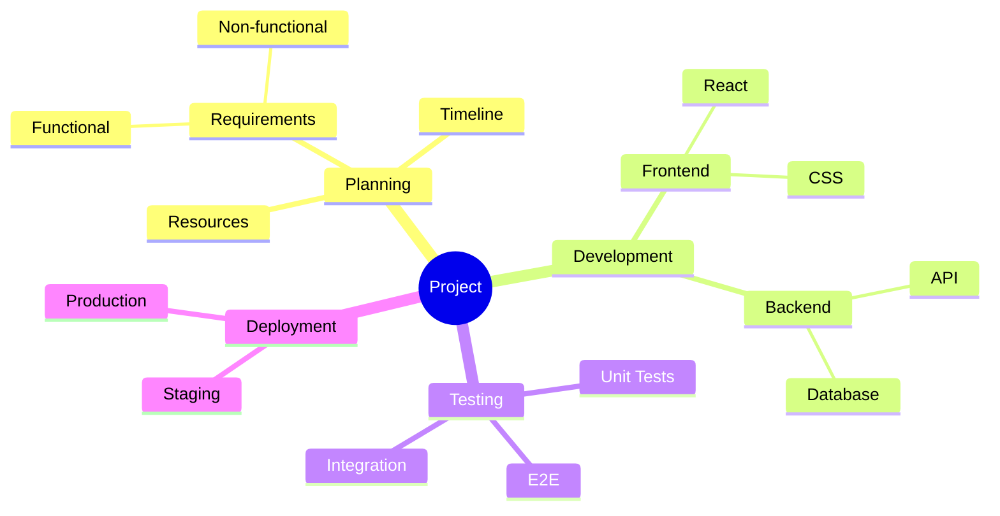
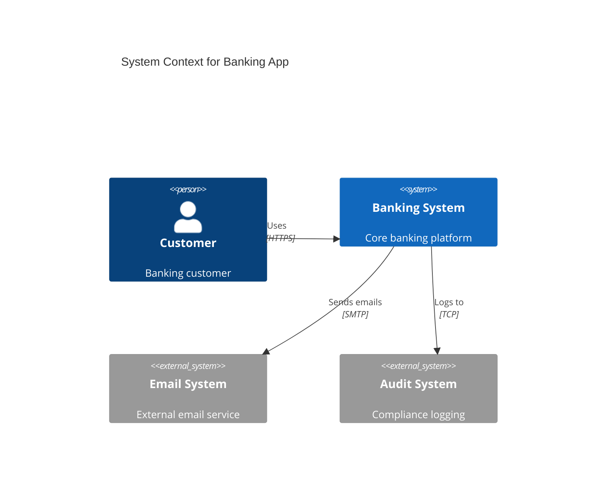

# Mermaid Diagrams: Connections & Elements Quick Reference

## Class Diagrams

### All Connection Types

### Element Types

- **Class** — Blueprint with attributes/methods
- **Interface** — Contract defining methods
- **Abstract Class** — Non-instantiable class
- **Enumeration** — Fixed set of constants
- **Package** — Grouping mechanism
- **Data Type** — Primitive/user-defined types

### Connection Types

- **Association** — Basic structural connection
- **Aggregation** — Weak whole-part relationship
- **Composition** — Strong whole-part relationship
- **Inheritance** — "Is-a" relationship
- **Realization** — Interface implementation
- **Dependency** — Uses without ownership
- **Reflexive** — Self-referencing relationship

---

## State Diagrams

### All Connection Types

### Element Types

- **Initial state** — Entry point `[*]`
- **State** — Named system mode
- **Final state** — End point `[*]`
- **Composite state** — Contains substates
- **Transition** — Arrow between states

### Connection Types

- **Simple transition** — `A --> B`
- **Triggered transition** — `A --> B : onEvent`
- **Guarded transition** — `A --> B : [condition]`
- **Loop transition** — `A --> A`
- **Entry/Exit transitions** — Via nested states

---

## Sequence Diagrams

### All Connection Types

### Element Types

- **Participant** — Actor/system in interaction
- **Message** — Communication between participants
- **Activation box** — Execution duration (`+`/`-`)
- **Note** — Annotations
- **Control blocks** — `alt`/`else`, `loop`, `par`, `opt`

### Connection Types

- **Synchronous call** — `A->>B: action`
- **Return message** — `B-->>A: result`
- **Self-call** — `A->>A: recurse`
- **Control constructs** — Conditional/loop logic

---

## Entity-Relationship Diagrams

### All Connection Types

### Element Types

- **Entity** — Thing with distinct existence
- **Relationship** — Connection between entities
- **Associative Entity** — Junction with own attributes

### Connection Types

- **One-to-One** — `}|..||`
- **One-to-Many (optional)** — `||--o{`
- **One-to-Many (mandatory)** — `||--|{`
- **Many-to-Many** — Via associative entities
- **Recursive** — Self-referencing relationships

---

## Flowcharts

### All Connection Types

### Element Types

- **Process** — Rectangle `[text]`
- **Decision** — Diamond `{text}`
- **Start/End** — Rounded rectangle `([text])`
- **Event** — Circle `((text))`
- **Subgraph** — Container for grouped nodes
- **Database** — Cylinder `[(text)]`
- **Subroutine** — Double rectangle `[[text]]`

### Connection Types

- **Solid arrow** — `-->`
- **Labeled arrow** — `-->|label|`
- **Dotted arrow** — `-.->` (optional/conditional)
- **Thick arrow** — `==>` (emphasis)
- **Bi-directional** — `<-->`
- **No arrow** — `---` (association only)

---

## Gitgraph (Git Flow)

### All Connection Types

### Element Types

- **Commit** — Point in version history
- **Branch** — Parallel development line
- **Main/Master** — Primary branch
- **Feature branch** — Topic-specific branch
- **Tag** — Named reference point

### Connection Types

- **Commit** — Sequential development
- **Branch** — Divergent development path
- **Merge** — Combining branches
- **Checkout** — Switch active branch
- **Cherry-pick** — Copy specific commit

---

## User Journey

### All Connection Types

### Element Types

- **Journey** — Overall user experience
- **Section** — Phase of the journey
- **Task** — Specific user action
- **Actor** — User, System, or external service
- **Score** — Satisfaction rating (1-5)

### Connection Types

- **Sequential flow** — Tasks follow chronological order
- **Actor involvement** — Multiple actors per task
- **Satisfaction mapping** — Emotional journey tracking
- **Phase transitions** — Section boundaries

---

## Mindmaps

### All Connection Types

### Element Types

- **Root** — Central topic `((text))`
- **Branch** — Main category
- **Sub-branch** — Nested topic
- **Leaf** — Terminal node
- **Node** — Any point in hierarchy

### Connection Types

- **Hierarchical** — Parent-child relationships
- **Radial** — Branches from center
- **Nested** — Multiple levels deep
- **Associative** — Conceptual grouping

---

## C4 Context Diagrams

### All Connection Types

### Element Types

- **Person** — Human user
- **System** — Internal software system
- **System_Ext** — External system
- **Container** — Deployable unit
- **Component** — Code component
- **Boundary** — System/container boundary

### Connection Types

- **Rel** — General relationship
- **BiRel** — Bi-directional relationship
- **Rel_U/D/L/R** — Directional relationships
- **UpdateRelStyle** — Styling adjustments
- **System boundaries** — Logical grouping
